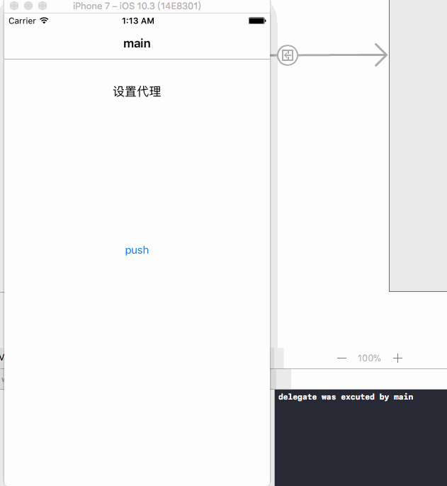

# weak_Delegates
how to create delegates with "weak"? [中文介绍](./weak_Delegates/Documents/README_chs.md)


---

- ###how to use?

  ```swift
  /// 初始化, 泛型传入代理类型
  var delegates = WeakArray<someProtocol>()

  // 添加
  delegates.add(someProtocol1)

  // 移除
  delegates.remove(someProtocol2)

  // 触发代理
  delegates.excute(block)      // block: ((someProtocol?)->)
  ```

- ###Installation

    #####CocoaPods
    ```
    pod 'weak_Delegates', '~> 0.1.0'
    ```

    #####Carthage

    ```
    github "515783034/weak_Delegates" ~> 0.1.0
    ```
